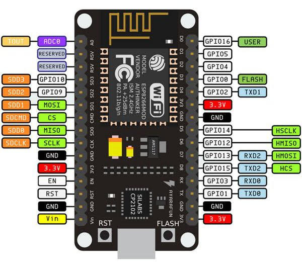
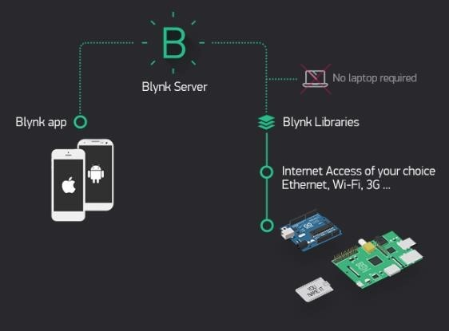
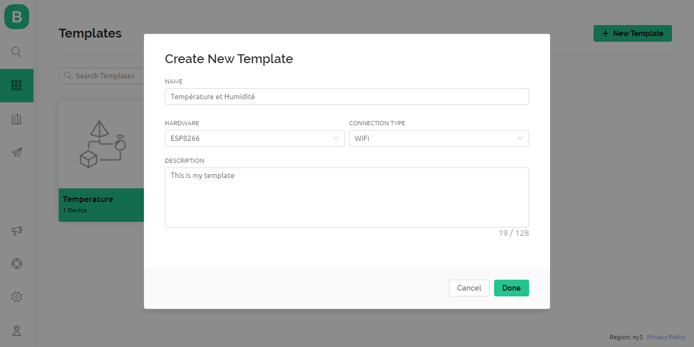
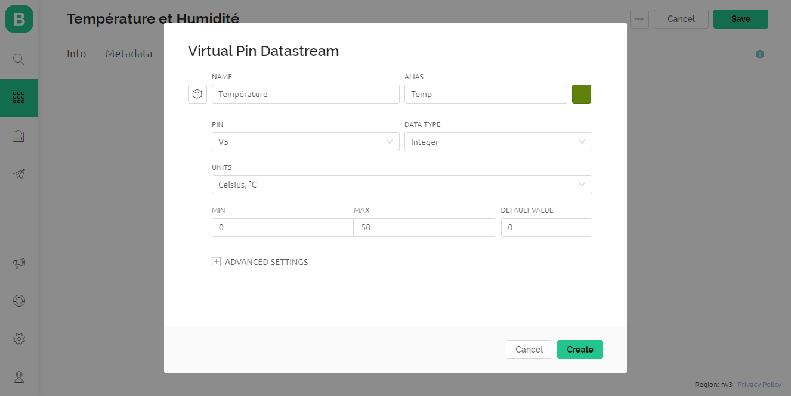
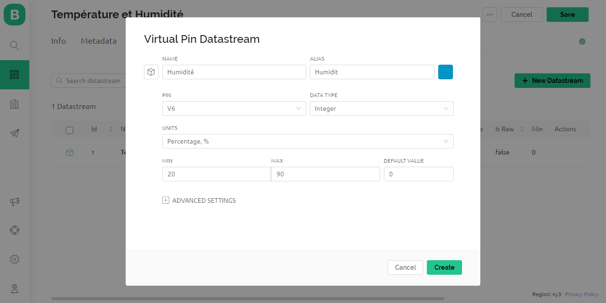
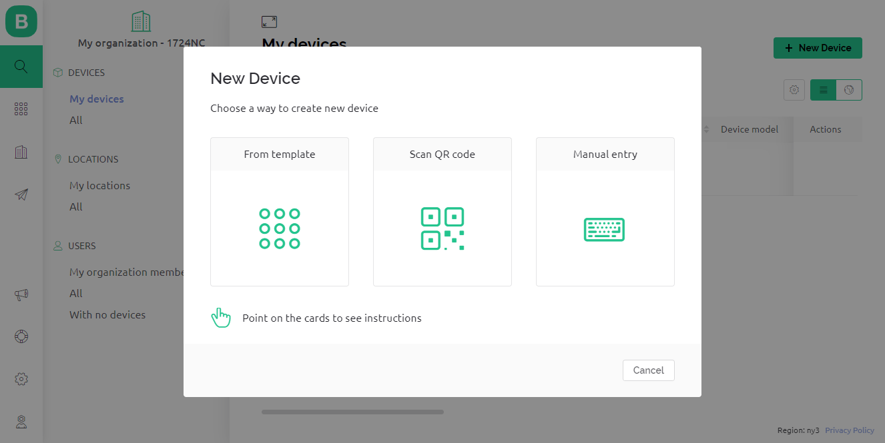
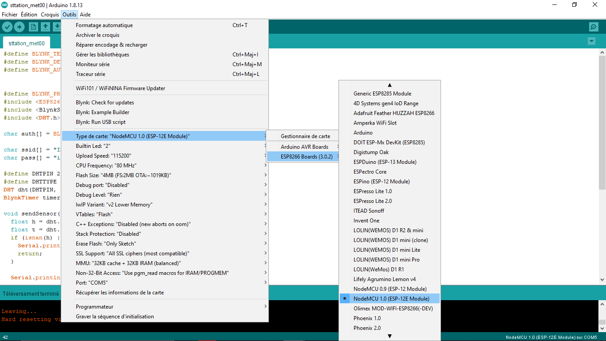
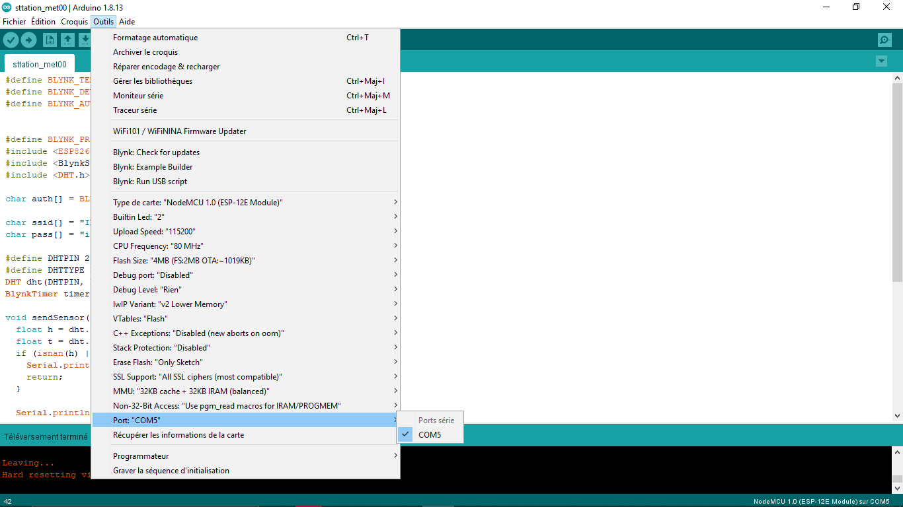
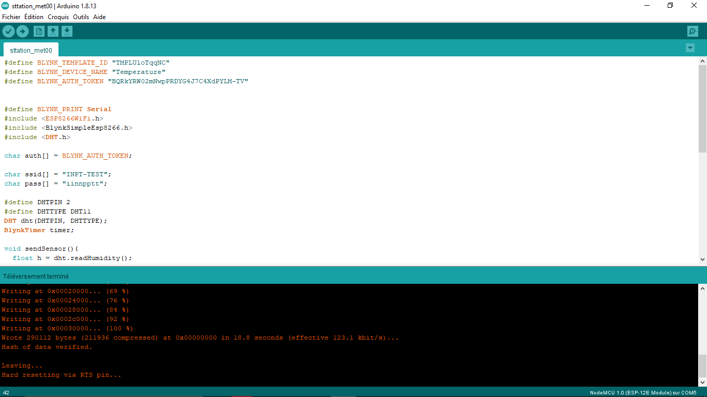
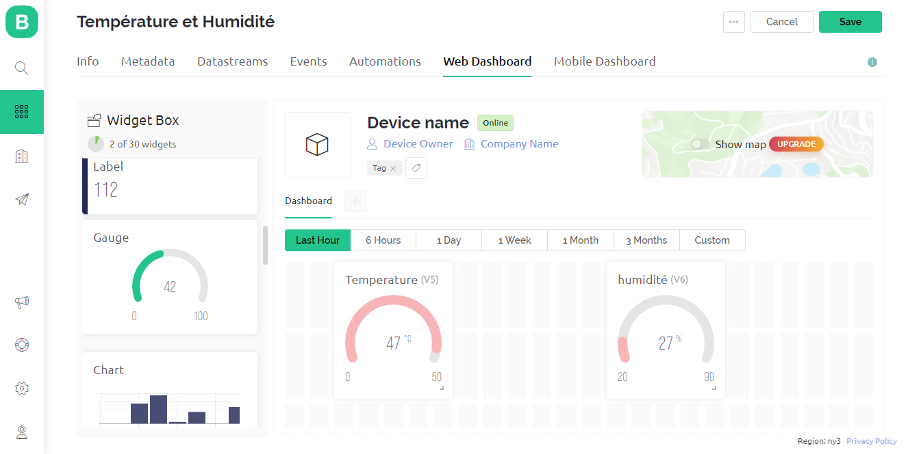

#  Weather Station

The "Creation of a Connected Weather Station with ESP8266 and Blynk" project is an exploration of the Internet of Things (IoT) in the field of meteorology. It involves designing and building a weather station that can collect, transmit, and display weather data in real-time using the ESP8266 Wi-Fi module and the Blynk IoT platform.
This project allows us to monitor and display real-time temperature and humidity data using the ESP8266 and DHT11.

# Hardware Description
## The ESP8266
The ESP8266 is a popular and versatile Wi-Fi module used in various applications. Its primary role is to provide Wi-Fi connectivity to microcontrollers and embedded systems, making it an essential component for the Internet of Things (IoT) and wireless communication

## The DHT11 sensor

# Software Description
## Install and configure Arduino IDE
Make sure you use a version of the Arduino IDE which is supported by the ESP8266 platform. Follow the tutorial on our documentation platform.

## Install libraries in Arduino IDE
Install the following libraries with your Arduino Library Manager in Sketch > Include Library > Manage Libraries...

## Blynk Platform Operation:

## Blynk Platform Configuration:
#### Customize the Blynk Interface by creating virtual pins for temperature and humidity
Screenshots

#### Creation of a new device
 Screenshot
 

#### Copying the FIRMWARE CONFIGURATION which includes the model ID, device name, and AuthToken to Arduino IDE.
Screenshot

## Arduino IDE Configuration:
#### Select the board that you are going to use, and then choose the port where your ESP8266 board is connected.
Screenshot

#### Select the Port
 Screenshot
 

#### Next, include the libraries. The (WIFI_PASSWORD) and (WIFI_SSID) are used to allow the ESP8266 to connect to the Wi-Fi network (the available internet access point). On the other hand, (AUTH Blynk) is specific to the application running on Android or iOS and is used to identify the hardware it should communicate with.
#### Compile the code and upload it to the board
 Screenshot
 

# Data Visualization:

